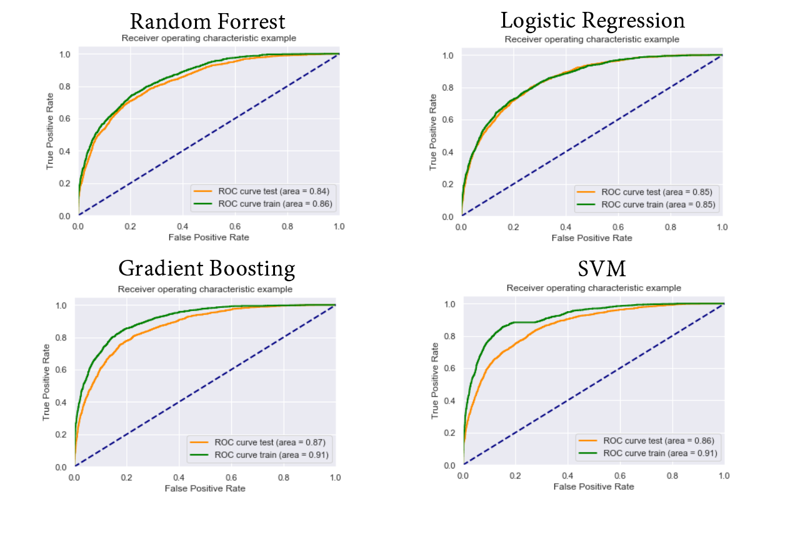

# Modeling 2017's french presidential election results using machine learning on INSEE databases

We aim at modelling 2017's french presidential election by using machine learning algorithms on different subsets of the INSEE databases. Our goal is to answer the following questions : how accurately can we predict the election results in a particular town, based on the several  statistics the INSEE have produced once we have trained our model on a subset of french cities ? Which features have the greater impact on the results or on the turnout ? What can we learned  about the candidates just by knowing the specificity and election results on each city ? 
In a more general way, we want to know in what extend the socio-economic factors are by themselves sufficient to predict the result of an election.

## Second round

We tried predicting the winner of the election in the second round for each town. Using different classification algorithms, we used a gridsearch on multiple folds to tune our models.
We selected a subset of our dataset to only have cities with more than 500 inhabitants. By doing so, we remove outliers that are very often small villages : their behaviour is very hard to predict, so we focused on larger cities. 
After selecting the best hyperparameters for each models, this is all the ROC curve we get.

